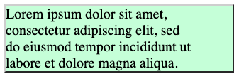
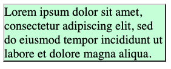

# Shrink-to-fit container

This proposal is an early design sketch by Google Chrome Layout Team to describe the problem below and solicit
feedback on the proposed solution. It has not been approved to ship in Chrome.

## Participate
- https://github.com/w3c/csswg-drafts/issues/191


## Introduction

In CSS, the [`fit-content`](https://drafts.csswg.org/css-sizing-3/#funcdef-width-fit-content) keyword is often used to size block containers dynamically. However, when text inside the container wraps onto multiple lines, [`fit-content`](https://drafts.csswg.org/css-sizing-3/#funcdef-width-fit-content) determines the container width based on the maximum allowable layout width rather than wrapping tightly around the actual line-broken text layout, leaving awkward empty space to the right. This explainer introduces the `max-content-sizing` property, offering a shrink-to-fit mode that respects layout constraints and wrapped line metrics to calculate a tighter, more precise box model context.


## Goals

* Size the container width precisely based on the line-broken (wrapped) text layout or the flex lines.


## Non-goals

* Redefine standard intrinsic sizing logic across all complex layout modules, such as CSS Grid and Tables, which have native track sizing structures.


## Use cases

### Use case 1

```html
<div style="text-wrap:balance;
    width:fit-content;
    max-width:320px;
    border: 2px outset gray;">
  <div style="width:fit-content">
    Lorem ipsum dolor sit amet, consectetur adipiscing elit, sed do eiusmod tempor
    incididunt ut labore et dolore magna aliqua.
  </div>
</div>
```

Both of the outer div and the inner div have the same width, 320px. The text is wrapped within 320px, so the right edge of the text is not aligned to the right edge of the divs typically.



## Proposal: The `max-content-sizing` Property

The proposal defines a new CSS property applicable to block containers to control how [max-content inline sizes](https://drafts.csswg.org/css-sizing-3/#max-content-inline-size) are calculated.

* Name: `max-content-sizing`
* Values: `auto | shrink-to-fit`
* Initial: `auto`
* Inherited: No

`auto` - The default behavior. Under this mode, the element behaves standardly: text elements calculate their max-content size based on the length of the unwrapped inline text string.

`shrink-to-fit` - This value alters [max content inline size](https://drafts.csswg.org/css-sizing-3/#max-content-inline-size) of the element and descendants.
* If the element is an **inline formatting context**, [max content inline size](https://drafts.csswg.org/css-sizing-3/#max-content-inline-size) would be the widest line content wrapped within the [fit-content inline size](https://drafts.csswg.org/css-sizing-3/#fit-content-inline-size).
* If the element is a **block formatting context**, [max content inline size](https://drafts.csswg.org/css-sizing-3/#max-content-inline-size) would be the inline size of the widest child block.
* If the element is a **flex container with `flex-wrap:wrap`**, [max content inline size](https://drafts.csswg.org/css-sizing-3/#max-content-inline-size) would be the widest flex line content wrapped within the [fit-content inline size](https://drafts.csswg.org/css-sizing-3/#fit-content-inline-size).
* Otherwise, [max content inline size](https://drafts.csswg.org/css-sizing-3/#max-content-inline-size) is not altered.


The physical calculation for an inline formatting context resolves as follows:
1. Compute a hypothetical reference size based on the element's computed [fit-content inline size](https://drafts.csswg.org/css-sizing-3/#fit-content-inline-size).
1. Perform line-breaking layout operations of the text children or the flex items within this hypothetical size.
1. Evaluate the resolved layout and use the maximum inline size measured across all generated lines, explicitly excluding any trailing whitespaces on each line.

This ensures that the final container closely wraps around the actual text boundaries after natural wrapping has occurred.

Because the property changes the behavior of [max-content inline size](https://drafts.csswg.org/css-sizing-3/#max-content-inline-size), it affects `width:fit-content`, `width:fit-content(<percentage>)` as well as `width:max-content`, and would affect `width:auto` if auto depends on [max-content inline size](https://drafts.csswg.org/css-sizing-3/#max-content-inline-size).


### How this solution would solve the use cases


#### Use case 1

```html
<div style="max-content-sizing:shrink-to-fit;
    text-wrap:balance;
    width:fit-content;
    max-width:320px;
    border: 2px outset gray;">
  <div style="width:fit-content">
    Lorem ipsum dolor sit amet, consectetur adipiscing elit, sed do eiusmod tempor
    incididunt ut labore et dolore magna aliqua.
  </div>
</div>
```
Both of the outer div and the inner div have the same width, which is the widest line width.




## Detailed design discussion

### Open Issues

* Naming of the property and its keywords.
* How to handle containers containing `float:right` elements

## Considered alternatives

### Adding a new keyword to the width property

An alternative proposal was evaluated: adding a new keyword directly to the width property (e.g., `width:shrink-to-fit`).

While adding a new keyword to the `width` property is implementable, it's much more useful to actually modify the [max-content inline size](https://drafts.csswg.org/css-sizing-3/#max-content-inline-size) directly, as several layout algorithms directly reference that size and would benefit from switching to using this new smaller size. This also makes the engine implementation more straightforward.


## Security and Privacy Considerations

This feature won't have security/privacy implication.

